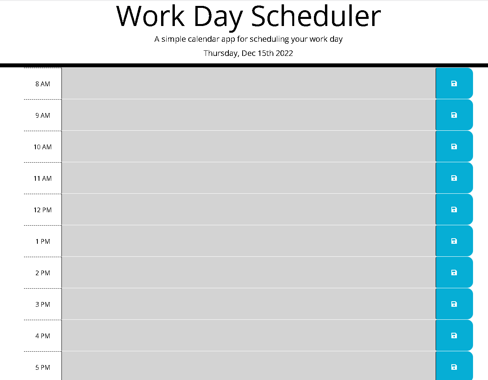

# Work-Day-Scheduler

## Description

A day scheduler app that allows the user to save an event which they input for each hour of the day from 8am-5pm. It runs using JQuery.
The motivation for this app is to create an app which would allow the user to organise and plan out their day efficiently.
This project was built in order to assist those in organising their day and to allow the user to remember what activities to do throughout the day.
The app solves the choas a user can have, and provides them with a sense of organisation and order.
I learnt how to use JQuery in order to target past, present and future elements using the time function.

## Installation

N/A

## Usage
To use app, enter an activity or TODO list into the certain hour the user wants to complete activity, then press save.
The grey color shows time that has past, the red color displays time the hour that is present, the green shows the future hours to come.

In the screenshot above, all boxes are grey as the time is 7pm and the hours only reach 5pm. This means all the hours in the day scheduler has been completed.

## Credits

N/A

## Licence 
MIT Licence

## Badges

## Features
Save feature
Entering text in text box
Past, present and future element colour coded.
more
